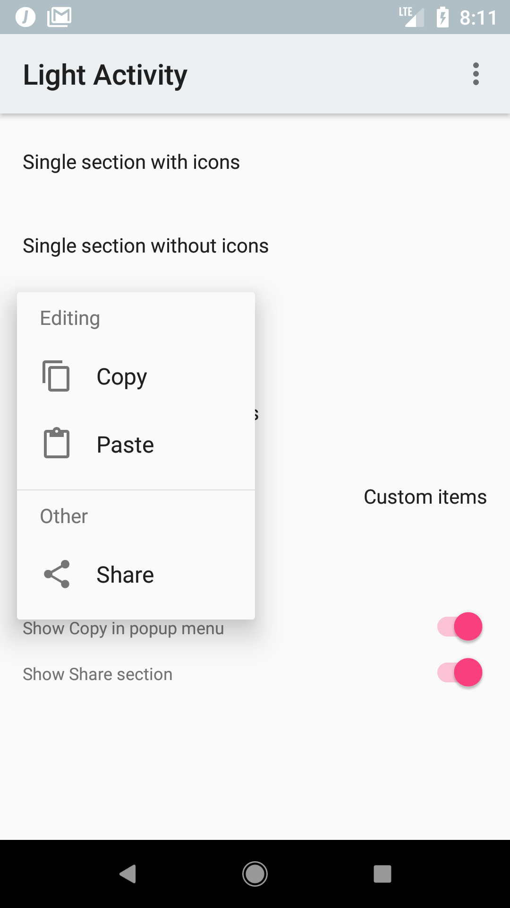
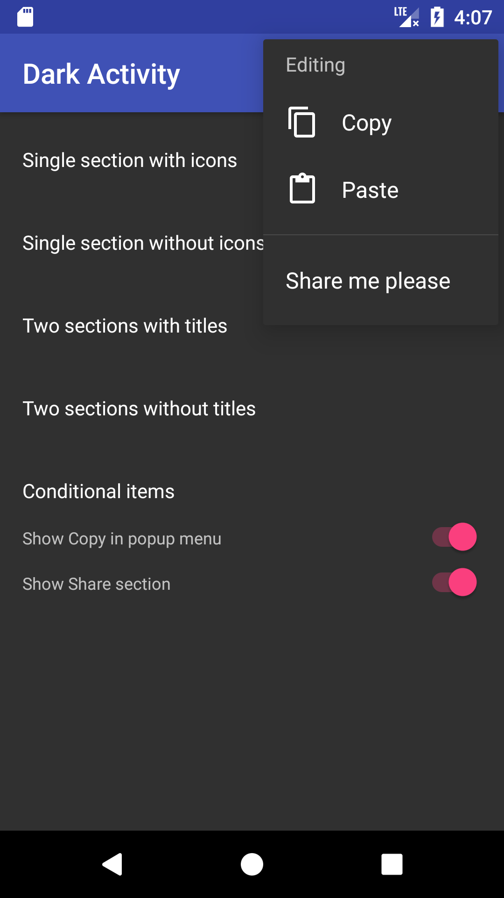
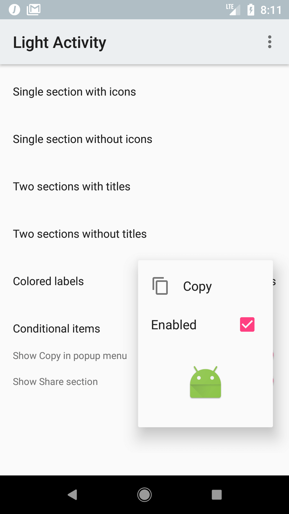
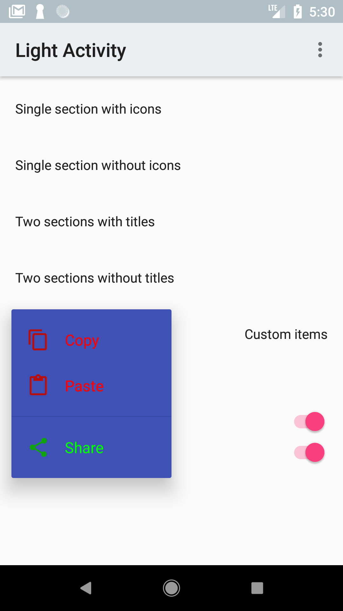

<p align="center">
  
</p>

# Material Popup Menu [](https://circleci.com/gh/zawadz88/MaterialPopupMenu)

This library allows to create simple popup menus programmatically with a nice [type-safe builder syntax in Kotlin](https://kotlinlang.org/docs/reference/type-safe-builders.html). Menus can be divided into separate sections with optional headers and contain icons.

&nbsp;&nbsp;

## Download (from JCenter)
```groovy
implementation 'com.github.zawadz88.materialpopupmenu:material-popup-menu:2.1.0'
```

## Getting started

To create a popup menu with a single section from an anchor view:
```kotlin
    fun onSingleSectionWithIconsClicked(view: View) {
        val popupMenu = popupMenu {
            section {
                item {
                    label = "Copy"
                    icon = R.drawable.abc_ic_menu_copy_mtrl_am_alpha //optional
                    callback = { //optional
                        Toast.makeText(this@LightActivity, "Copied!", Toast.LENGTH_SHORT).show()
                    }
                }
                item {
                    label = "Paste"
                    iconDrawable = ContextCompat.getDrawable(this@LightActivity, R.drawable.abc_ic_menu_paste_mtrl_am_alpha) //optional
                    callback = { //optional
                        Toast.makeText(this@LightActivity, "Text pasted!", Toast.LENGTH_SHORT).show()
                    }
                }
                item {
                    label = "Select all"
                    icon = R.drawable.abc_ic_menu_selectall_mtrl_alpha //optional
                }
            }
        }

        popupMenu.show(this@LightActivity, view)
    }

```

To create a popup menu with 2 sections and a section title in the second one:
```kotlin
    fun onSingleSectionWithIconsClicked(view: View) {
        val popupMenu = popupMenu {
            section {
                item {
                    label = "Copy"
                    icon = R.drawable.abc_ic_menu_copy_mtrl_am_alpha
                    callback = {
                        Toast.makeText(this@LightActivity, "Copied!", Toast.LENGTH_SHORT).show()
                    }
                }
                item {
                    label = "Paste"
                    icon = R.drawable.abc_ic_menu_paste_mtrl_am_alpha
                    callback = {
                        Toast.makeText(this@LightActivity, "Text pasted!", Toast.LENGTH_SHORT).show()
                    }
                }
            }
            section {
                title = "Other"
                item {
                    label = "Select all"
                    icon = R.drawable.abc_ic_menu_selectall_mtrl_alpha
                }
            }
        }

        popupMenu.show(this@LightActivity, view)
    }
```

## Supported features
* Showing popup menus with a builder pattern
* Separator between popup menu sections
* Section headers
* Light and dark styles
* Custom view items
* Setting item label text color & icon color for each individual item
* Setting custom popup background color

## Custom views


You can use your own layouts for displaying the items in each section alongside the default layouts provided by the library. E.g.:
```kotlin
    fun onCustomItemsClicked(view: View) {
        val popupMenu = popupMenu {
            dropdownGravity = Gravity.END
            section {
                item {
                    label = "Copy"
                    icon = R.drawable.abc_ic_menu_copy_mtrl_am_alpha
                    callback = {
                        Toast.makeText(this@LightActivity, "Copied!", Toast.LENGTH_SHORT).show()
                    }
                }
                customItem {
                    layoutResId = R.layout.view_custom_item_checkable
                    viewBoundCallback = { view ->
                        val checkBox: CheckBox = view.findViewById(R.id.customItemCheckbox)
                        checkBox.isChecked = true
                    }
                    callback = {
                        Toast.makeText(this@LightActivity, "Disabled!", Toast.LENGTH_SHORT).show()
                    }
                }
                customItem {
                    layoutResId = R.layout.view_custom_item_large
                }
            }
        }

        popupMenu.show(this@LightActivity, view)
    }
```

## Custom colors


To achieve the above you need to set `labelColor` and `iconColor` on each item in a section as shown here:
```kotlin
    fun onCustomColorsClicked(view: View) {
        val popupMenu = popupMenu {
            style = R.style.Widget_MPM_Menu_Dark_CustomBackground
            section {
                item {
                    label = "Copy"
                    labelColor = ContextCompat.getColor(this@LightActivity, R.color.red)
                    icon = R.drawable.abc_ic_menu_copy_mtrl_am_alpha
                    iconColor = ContextCompat.getColor(this@LightActivity, R.color.dark_red)
                    callback = {
                        Toast.makeText(this@LightActivity, "Copied!", Toast.LENGTH_SHORT).show()
                    }
                }
                item {
                    label = "Paste"
                    labelColor = ContextCompat.getColor(this@LightActivity, R.color.red)
                    icon = R.drawable.abc_ic_menu_paste_mtrl_am_alpha
                    iconColor = ContextCompat.getColor(this@LightActivity, R.color.dark_red)
                    callback = {
                        Toast.makeText(this@LightActivity, "Text pasted!", Toast.LENGTH_SHORT).show()
                    }
                }
            }
            section {
                item {
                    label = "Share"
                    labelColor = ContextCompat.getColor(this@LightActivity, R.color.green)
                    icon = R.drawable.abc_ic_menu_share_mtrl_alpha
                    iconColor = ContextCompat.getColor(this@LightActivity, R.color.dark_green)
                    callback = {
                        shareUrl()
                    }
                }
            }
        }

        popupMenu.show(this@LightActivity, view)
    }
```

To change the popup background color you need to create a custom style and pass it under `style` to the popup builder above.
E.g. to use the primary color you could define the style like this:
```xml
<resources>
    <style name="Widget.MPM.Menu.Dark.CustomBackground">
        <item name="android:colorBackground">@color/colorPrimary</item>
    </style>
</resources>
```

## Documentation
HTML documentation of the current version of the library is available [here](https://zawadz88.github.io/MaterialPopupMenu/material-popup-menu/).

## Third Party Bindings

### React Native
You may now use this library with [React Native](https://github.com/facebook/react-native) via the module [here](https://github.com/prscX/react-native-popover-menu)

## FAQ

### I want to use the library but I don't know Kotlin
Kotlin is extremely easy to use if you already know Java.
Check out the [official documentation](https://kotlinlang.org/docs/reference/basic-syntax.html) - it's really great!

## TODOs:
* add Espresso tests
* add an option to change the offsets and popup width
* add item selection
* refactor measuring
