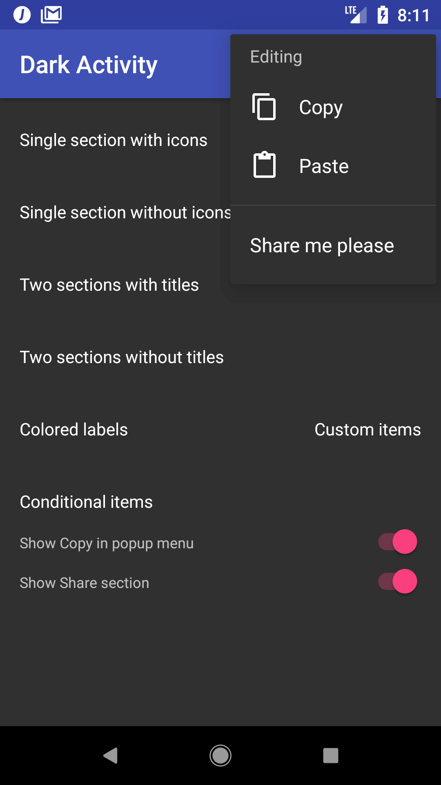

<p align="center">
  
</p>

# Material Popup Menu [](https://circleci.com/gh/zawadz88/MaterialPopupMenu)

This library allows to create simple popup menus programmatically with a nice [type-safe builder syntax in Kotlin](https://kotlinlang.org/docs/reference/type-safe-builders.html).

&nbsp;&nbsp;

## Download (from JCenter)
```groovy
compile 'com.github.zawadz88.materialpopupmenu:material-popup-menu:1.0.0'
```

## Getting started

To create a popup menu with a single section from an anchor view:
```kotlin
    fun onSingleSectionWithIconsClicked(view: View) {
        val popupMenu = popupMenu {
            section {
                item {
                    label = "Copy"
                    icon = R.drawable.abc_ic_menu_copy_mtrl_am_alpha //optional
                    callback = { //optional
                        Toast.makeText(this@LightActivity, "Copied!", Toast.LENGTH_SHORT).show()
                    }
                }
                item {
                    label = "Paste"
                    icon = R.drawable.abc_ic_menu_paste_mtrl_am_alpha //optional
                    callback = { //optional
                        Toast.makeText(this@LightActivity, "Text pasted!", Toast.LENGTH_SHORT).show()
                    }
                }
                item {
                    label = "Select all"
                    icon = R.drawable.abc_ic_menu_selectall_mtrl_alpha //optional
                }
            }
        }

        popupMenu.show(this@LightActivity, view)
    }

```

To create a popup menu with 2 sections and a section title in the second one:
```kotlin
    fun onSingleSectionWithIconsClicked(view: View) {
        val popupMenu = popupMenu {
            section {
                item {
                    label = "Copy"
                    icon = R.drawable.abc_ic_menu_copy_mtrl_am_alpha
                    callback = {
                        Toast.makeText(this@LightActivity, "Copied!", Toast.LENGTH_SHORT).show()
                    }
                }
                item {
                    label = "Paste"
                    icon = R.drawable.abc_ic_menu_paste_mtrl_am_alpha
                    callback = {
                        Toast.makeText(this@LightActivity, "Text pasted!", Toast.LENGTH_SHORT).show()
                    }
                }
            }
            section {
                title = "Other"
                item {
                    label = "Select all"
                    icon = R.drawable.abc_ic_menu_selectall_mtrl_alpha
                }
            }
        }

        popupMenu.show(this@LightActivity, view)
    }
```

## Supported features
* Showing popup menus with a builder pattern
* Separator between popup menu sections
* Section headers
* Light and dark styles

## FAQ

### I want to use the library but I don't know Kotlin
Kotlin is extremely easy to use if you already know Java.
Check out the [official documentation](https://kotlinlang.org/docs/reference/basic-syntax.html) - it's really great!

## TODOs:
* add Espresso tests
* add an option to change the offsets and popup width
* add custom view support
* add item selection
* refactor measuring
